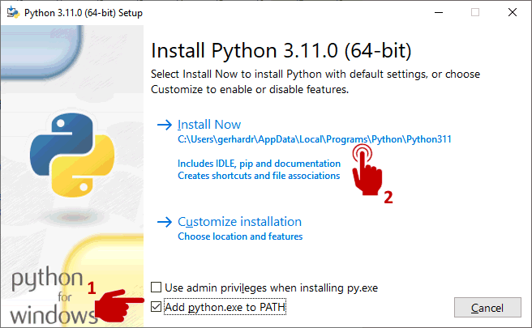

# Python installieren
Python ist eine leicht zu erlernende Skriptsprache, die wir sehr häufig in den [praktischen Übungen](Link darauf?) zu unserem Buch verwenden. Wenn du auf deinem Laptop oder PC keine Software installieren darfst oder möchtest, weil dies zum Beispiel ein Firmen-Laptop oder ein ausgeliehener PC eines Bekannten ist, kannst Du unsere [Übungen auch ohne installiertes Python nutzen](...).

Wenn du dir nicht sicher bist, ob python schon installiert ist, kannst du in Windows im entpackten Verzeichnis unseres GitHub Repositories das Befehlsskript `01_python_version.cmd` per Doppel-Click starten. Es zeigt dir entweder dieinstallierte python Version an, oder gibt aus, dass python nicht als Befehl gefunden wurde. Wir empfehlen die Version 3.11 oder höher.

Die **unterstützten Betriebssysteme** findest Du auf der [Python Homepage](https://www.python.org/):
* Windows
* macOS
* Linux/UNIX
* andere Plattformen

**Zur Installation** sind nur wenige Schritte notwendig:
* Öffne die offizielle [Python Download](https://www.python.org/downloads)-Seite
* Lade von dort bitte die **64-bit** Version für das **Betriebssystem deines PCs oder Laptops** herunter.
* Starte den Installer und folge den Anweisung, oder lies genauer im [Beginners Guide](https://wiki.python.org/moin/BeginnersGuide/Download) für dein Betriebssystem.
  (1) Achte darauf, dass das Hinzufügen des Pfades angehakt ist.
  (2) Starte die Installation.

 
